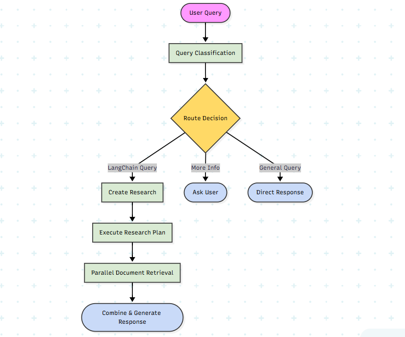

# Advance-Agentic-RAG-System-Chat-Langchain

An intelligent, agentic Retrieval-Augmented Generation (RAG) system built with LangChain and LangGraph that goes beyond traditional RAG by implementing autonomous research planning, intelligent query routing, and multi-step reasoning capabilities.

## 🎯 What is This Project?

This is an **Agentic RAG System** - a next-generation question-answering system specifically designed for LangChain documentation. Unlike traditional RAG systems that perform simple retrieval and generation, this system employs autonomous agents that can:

- **Intelligently classify and route queries** to appropriate processing pipelines
- **Create and execute multi-step research plans** for complex questions
- **Perform parallel document retrieval** with query expansion and re-ranking
- **Maintain conversational context** across multiple interactions
- **Stream responses in real-time** with progress updates

The system is built to provide comprehensive, accurate answers about LangChain, LangGraph, and LangSmith technologies by leveraging the entire LangChain documentation ecosystem.

## 🏗️ System Architecture

*Figure: Complete flow of the Agentic RAG System showing query classification, research planning, parallel retrieval, and response generation*

## 🚀 Key Features & How It Differs from Traditional RAG

### 1. **Intelligent Query Classification & Routing**
Traditional RAG systems treat all queries the same way. Our system uses an AI-powered query classifier that:
- Categorizes queries into `langchain`, `general`, or `more_info` types
- Routes each query type through specialized processing pipelines
- Adapts retrieval strategies based on query complexity and intent

### 2. **Autonomous Research Planning**
Instead of a single retrieval step, the system:
- **Creates multi-step research plans** (3-5 steps) for complex queries
- **Executes research steps in parallel** for faster processing
- **Expands queries** into multiple search variations to improve recall
- **Re-ranks documents** using LLM-based relevance scoring

### 3. **LangGraph-Based Orchestration**
The entire workflow is orchestrated using **LangGraph**, enabling:
- **Stateful conversation management** with persistent memory
- **Conditional routing** between different processing nodes
- **Error handling and retry logic** at each step
- **Streaming support** with real-time progress updates

### 4. **Advanced Retrieval Pipeline**
- **Query Expansion**: Generates 3-5 diverse search queries per research step
- **Parallel Retrieval**: Executes multiple searches simultaneously
- **Document Re-ranking**: Uses LLM-based relevance scoring
- **Deduplication**: Removes duplicate documents intelligently

### 5. **Conversational Memory & Context**
- Maintains conversation history across sessions
- Tracks user preferences and context
- Stores research plans and results for future reference
- Enables follow-up questions with full context awareness

### 6. **Real-Time Streaming & Progress Updates**
- Streams responses token-by-token for better UX
- Provides progress updates during research and generation
- WebSocket support for real-time bidirectional communication

### Agent Workflow (LangGraph)

The system uses a state machine with the following nodes:

1. **Initialize State** → Load conversation memory and context
2. **Classify Query** → Determine query type and routing
3. **Route to Handler**:
   - `handle_langchain` → Multi-step research for LangChain queries
   - `handle_general` → Direct retrieval for general queries
   - `handle_more_info` → Clarification requests
4. **Research & Retrieve** → Parallel document retrieval with re-ranking
5. **Generate Response** → Create comprehensive answer (streaming or non-streaming)
6. **Finalize** → Update memory and save conversation state

### Backend Core
- **LangChain** - Core framework for RAG and LLM orchestration
- **LangGraph** - State machine and workflow orchestration
- **LangChain Google GenAI** - Google Gemini models integration
- **FAISS** - High-performance vector similarity search
- **FastAPI** - Modern async web framework

### Key Advantages

✅ **Adaptive Processing**: Different strategies for different query types  
✅ **Multi-Step Reasoning**: Complex queries broken into research steps  
✅ **Parallel Execution**: Faster processing through concurrent operations  
✅ **Intelligent Retrieval**: Query expansion and re-ranking improve accuracy  
✅ **Context Awareness**: Full conversation history and user preferences  
✅ **Error Resilience**: Retry logic and fallback mechanisms at each step  
✅ **Observability**: Detailed logging and state tracking throughout
